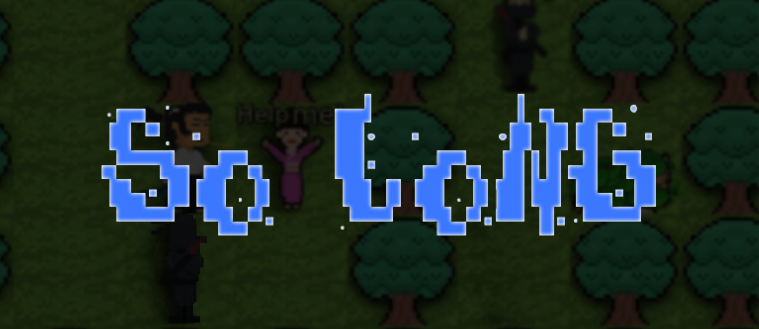
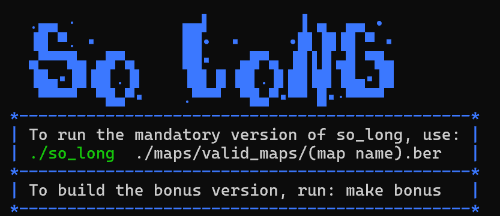
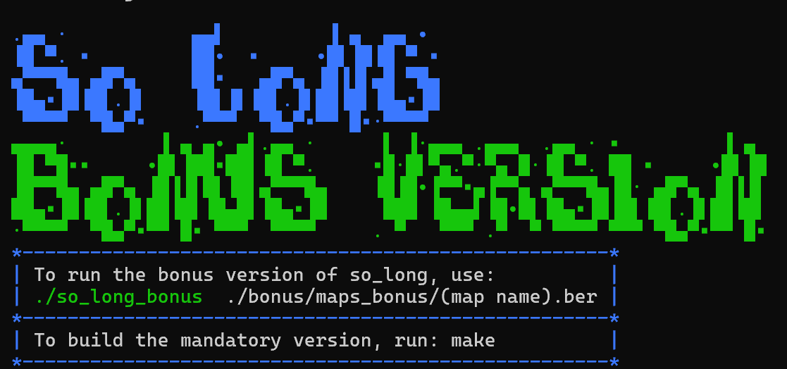

# 𒅒𒈔𒅒𒇫𒄆🥷🏼🎎
So Long is a simple 2D game project where you play as a **samurai** 👹  
on a quest to collect flowers or save hostages before escaping on your horse 🐴.

## ⚙️ Installation

1. **Clone the repository**:

    ```bash
    git clone https://github.com/josmanov/so_long.git
    ```

2. **Enter the project directory**:

    ```bash
    cd so_long
    ```

3. **For the mandatory version** (Collect flowers and escape):

    ```bash
    make
    ```

4. **For the bonus version** (Save hostages and escape):

    ```bash
    make bonus
    ```

## 🕹️ Controls

- **W** – Move Up ⬆️  
- **A** – Move Left ⬅️  
- **S** – Move Down ⬇️  
- **D** – Move Right ➡️  
- **Arrow Keys** – You can also use the **Arrow Keys** for movement:
  - **↑** – Move Up
  - **←** – Move Left
  - **↓** – Move Down
  - **→** – Move Right

## 👾 Gameplay

### **Mandatory Version**:



- You control the **samurai** 👹.
- Your goal is to **collect all the flowers** 🌸.
- Once all flowers are collected, you can **escape on your horse** 🐴 to finish the level!

### **Bonus Version**:



- Same gameplay as the mandatory version, but with an extra twist: 
- This time you must **save all the hostages** 🧑‍🤝‍🧑 before escaping on your horse.
- Watch out for the **ninjas** 🥷 patrolling the map!

## 🌍 Built With

- **C** – The game logic.
- **MLX42** – The 2D graphical library [MLX42](https://github.com/codam-coding-college/MLX42)
- **Libft** – My own custom utility library.

---

## 🛠️ Creating Your Own Map

To create your own custom map for the game, follow these conditions to make sure your map is valid.

### Map Format

The map is represented as a **2D grid** using the following characters:

- `1` = Wall 🧱
- `0` = Empty space 🌱
- `P` = Samurai starting position 🐉
- `E` = Exit 🚪
- `C` = Collectable items (e.g., flowers or hostages) 🌸🧑‍🤝‍🧑
(BONUS)
- `X` = Enemy (works only in bonus version, represented as a **ninja** 🥷)

### Map Conditions
- The map must have the .ber extension (map.ber)
- The map must contain:
  - Exactly **1 player (`P`)**.
  - Exactly **1 exit (`E`)**.
  - At least **1 collectable or more (`C`)**.
- The **exit (`E`)** must not obstruct the path to a collectable.
- The map must be **rectangular**.
- The **outside walls** must be fully closed (i.e., they must be `1`s).
- There must be a **path** (0) for the samurai (P) to reach the flowers or hostages (C) and the exit (E).

- **Bonus Version**:
  - The **enemy (`X`)** can be used for the bonus version to patrol the map.

---
## Example Bash Form Map Creation:
# To help you visualize the map:
- Mandatory Version
- `P` = Player (samurai) starting position.
- `C` = Collectable (flower).
- `E` = Exit.
- `1` = Wall.
```bash
11111111
1P0000E1
100C0001
11111111
```
- Bonus Version
- `X` = Enemy (ninja).
- `P` = Player (samurai) starting position.
- `C` = Collectable (hostage).
- `E` = Exit.
- `1` = Wall.
```bash
11111111
1P0X00E1
1000C001
11111111
```
